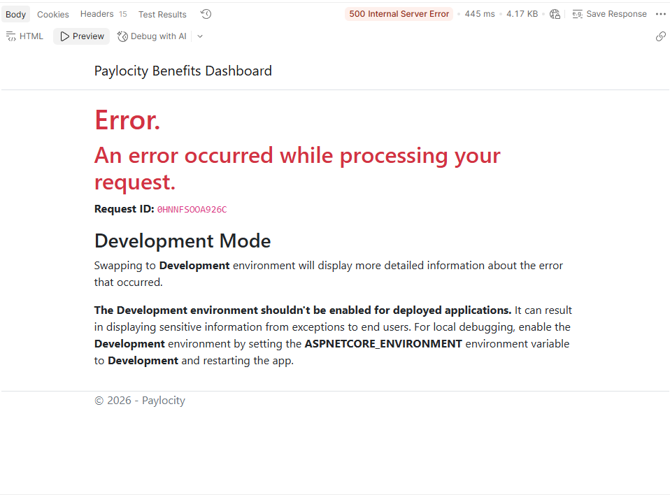

# API Bug Report - Paylocity Benefits Dashboard


## Severity & Likelihood Definitions
Severity
Critical — data loss, security breach, app unusable
High — major feature broken, no workaround
Medium — feature impaired but workaround exists
Low — cosmetic, minor inconvenience

Likelihood
Always/Certain — happens every time under normal use
Likely — happens under common, realistic conditions
Possible — happens under edge-case conditions a user might stumble into
Rare — happens only under deliberately unusual/malicious input


---

### 12. "username" is a required, unused, field for POST to /api/Employees
Severity: Low
Likelihood: Likely

When sending a POST to /api/Employees, the "username" field is required. However it is replaced with the logged in user's name after submission. This adds unnecessary steps to API testing and may cause confusion about the functionality.

Steps to reproduce:
In Postman, submit a POST request to /api/Employees with the following data
```json
{
    "firstName": "Jeremy",
    "lastName": "Brisebois",
    "username": "Anything",
    "dependants": 3
}
```
**Expected Result**: If the username is required it should be used in the submitted data
**Actual Result**: The username is discarded and replaced with the logged in user's name


---

### 13. "dependents" is not required with a POST to /api/Employees
Severity: Low
Likelihood: Possible

When sending a POST to /api/Employees, the "dependent" field is not required. This should be required in the API for consistency. It is worth noting that a POST with no "dependent" defaults to 0 dependents.

Steps to reproduce:
In Postman, submit a POST request to /api/Employees with the following data
```json
{
    "firstName": "Jeremy",
    "lastName": "Brisebois",
    "username": "Anything"
}
```
**Expected Result**: The API should give a 400 Bad Request that the dependent field is required
**Actual Result**: The request is allowed to process and a 0 is silently added as the number of dependents

---

### 14. "expiration" can be a past date with a POST to /api/Employees
Severity: Medium
Likelihood: Likely

(This is written under the assumption that "expiration" refers to a date at which the employee would be removed from this list should the functionality be added)
When sending a POST to /api/Employees, the "expiration" field can be a date in the past, leading to possible confusion or prematurely removed records.

Steps to reproduce:
In Postman, submit a POST request to /api/Employees with the following data
```json
{
    "firstName": "Jeremy",
    "lastName": "Brisebois",
    "username": "Anything",
    "dependants": 3,
    "expiration": "2012-07-13T02:02:38.902Z"
}
```
**Expected Result**: The API should give an error that the date should be in the future (with possible restrictions as to how far in the future)
**Actual Result**: Any date is allowed as long as it follows the date-time format.

---

### 15. "salary" and "id" should be read-only in a POST to /api/Employees
Severity: Low
Likelihood: Likely

When sending a POST to /api/Employees, the "salary" and "id" fields are not marked as read-only, making it look like the user can send values to these properties. However, the values are unused and discarded when sent. These fields should be marked as read-only to prevent confusion.

Steps to reproduce:
None - this change needs to take place in the model and updated in the swagger but the change will be functionally transparent
**Expected Result**: The documentation should have "salary" and "id" flagged as "read-only" the same way "gross", "benefitsCost" and "net" are "read-only"
**Actual Result**: The "salary" and "id" fields do not have "read-only"


---

### 16. Sending an invalid uuid returns 200 in a DEL to /api/Employees/{id}
Severity: Low
Likelihood: Possible

When sending a DEL to /api/Employees/{id} with a uuid that does not correspond to an employee, the server responds with a 200 as though an entry was successfully deleted, causing confusion.

Steps to reproduce:
1. In Postman, submit a DEL request to /api/Employees/{id} , using a uuid that doesn't not correspond to an entry in the benefits table.
**Expected Result**: The API should return a 404 that the employee is not found
**Actual Result**: The API returns a 200 Success, making it look like the delete was successful
Note: It seems there's a check against an "empty" uuid (00000000-0000-0000-0000-000000000000) as this will return a 405 error but every other uuid seems to be allowed


---

### 17. Sending an invalid uuid returns 200 in a GET to /api/Employees/{id}
Severity: Low
Likelihood: Rare

When sending a GET to /api/Employees/{id} with a uuid that does not correspond to an employee, the server responds with a 200 as though an entry for that uuid exists, however the response body is empty.

Steps to reproduce:
1. In Postman, submit a GET request to /api/Employees/{id} , using a uuid that doesn't not correspond to an entry in the benefits table.
**Expected Result**: The API should return a 404 that the employee is not found
**Actual Result**: The API returns a 200 Success, making it look like the retrieval was successful
Note: Sending an "empty" uuid (00000000-0000-0000-0000-000000000000) returns a 500 Internal Server Error. This case does not appear to be internally handled as it is in Bug 16 for DEL.

Screenshot of the 500 error



---

### 18. PUT to /api/Employees can create new employee entries with arbitrary salary
Severity: Critical
Likelihood: Likely

PUT is implemented at /api/Employees instead of scoped /api/Employees/{id} and shares a schema with POST. The repercussions of this can be severe. This implementation allows new employees to be created with PUT that bypasses the salary restrictions, allowing it to be overridden.

Steps to reproduce:
In Postman, submit a PUT request to /api/Employees with the following data
```json
{
    "firstName": "Jeremy",
    "lastName": "Brisebois",
    "username": "Anything",
    "id": {id}*,
    "salary": -1000
}
```
 * Use a uuid here that does not represent an existing employee
 **Expected Result**: The endpoint should not allow a PUT request to be sent. However, if it did, it should follow the same restrictions as the POST and discard the specified salary, replacing it with 52000
 **Actual Result**: A new employee is created with the sent data, using the unrestricted specified salary


---