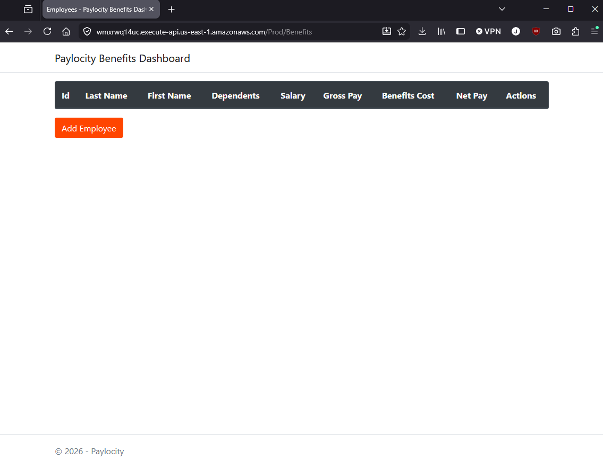
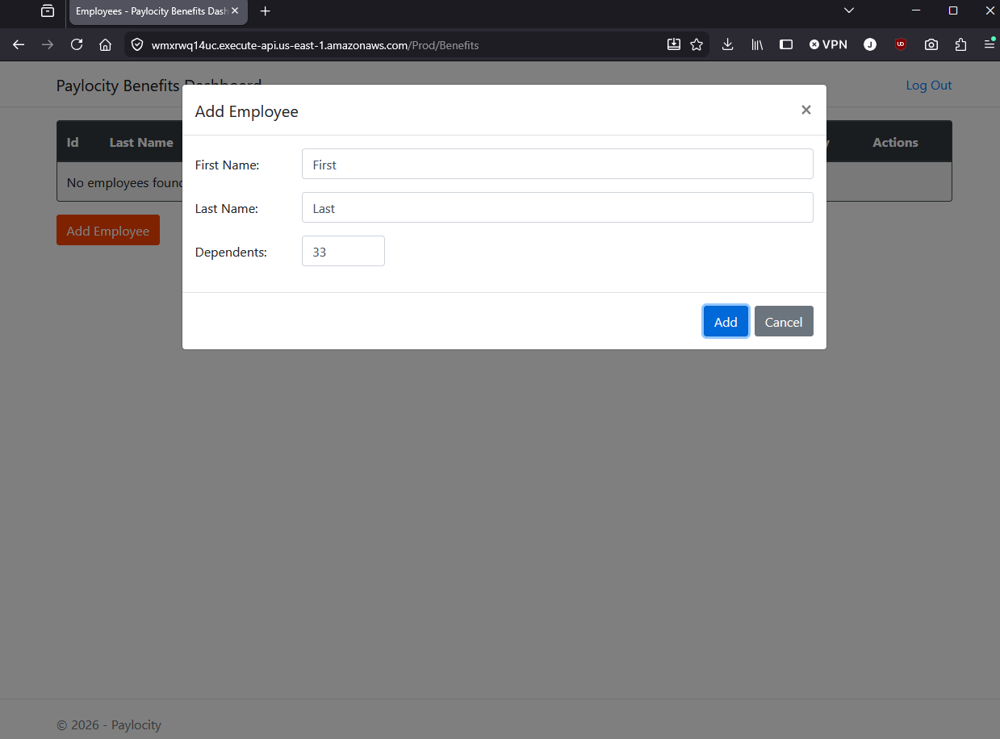
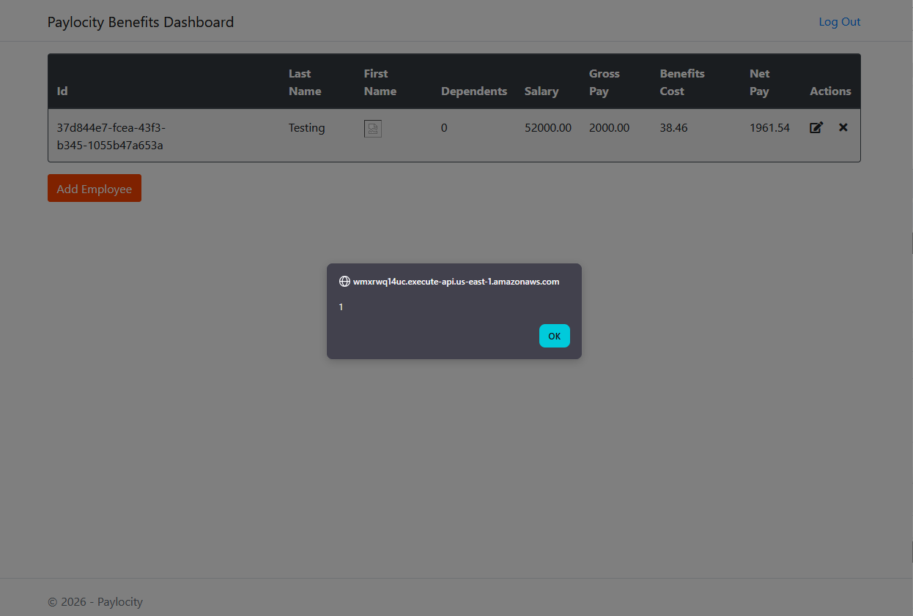
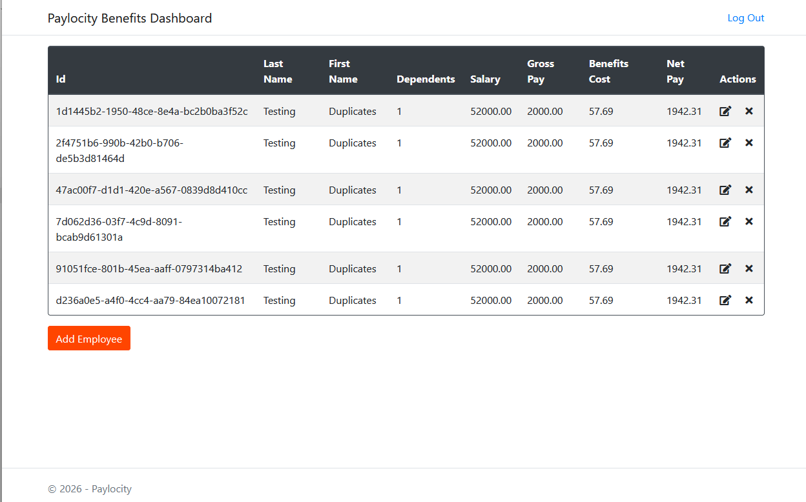
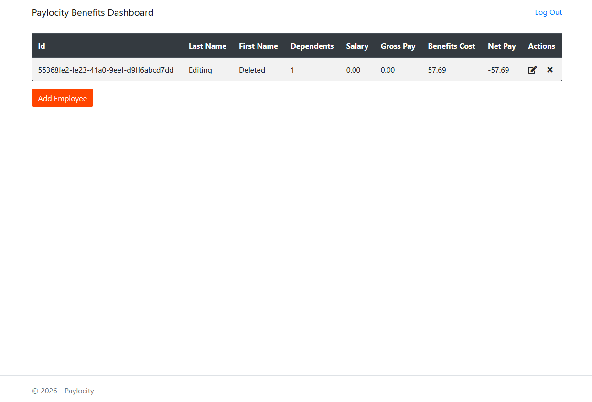
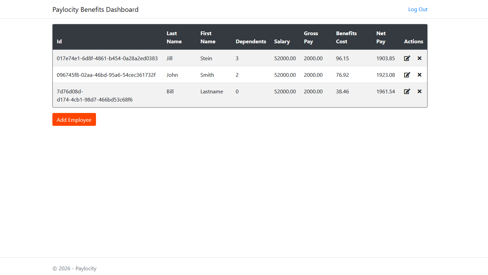
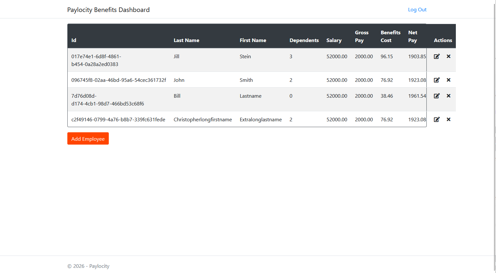
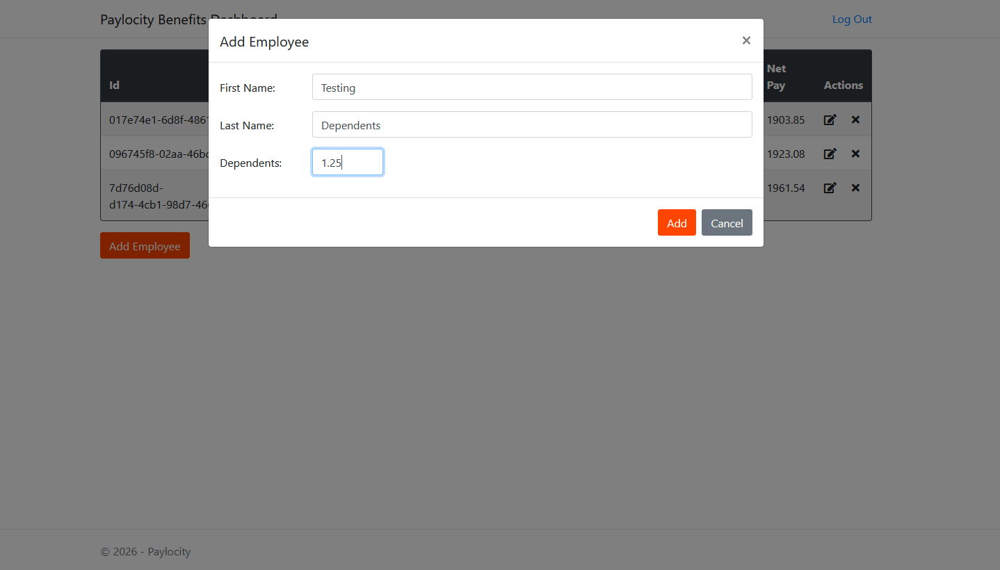
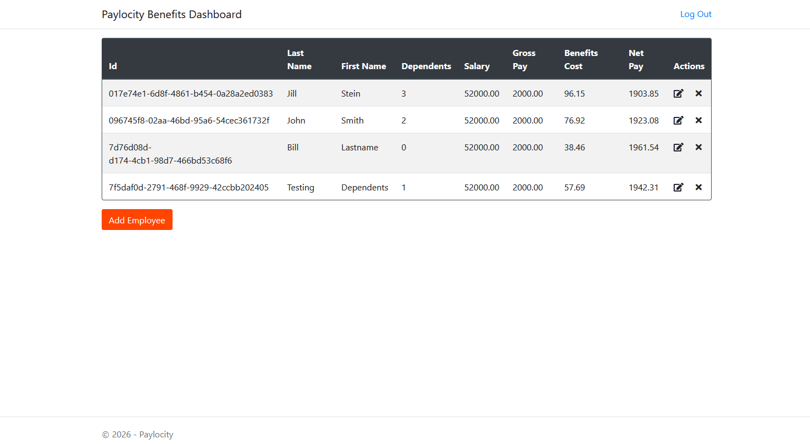
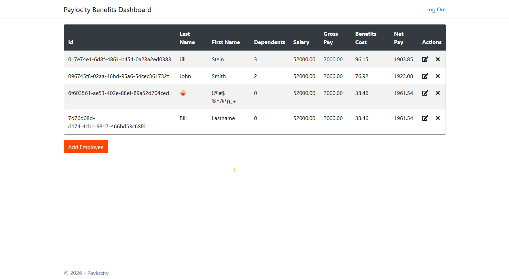

# UI Bug Report - Paylocity Benefits Dashboard

## Severity & Likelihood Definitions
Severity

Critical — data loss, security breach, app unusable

High — major feature broken, no workaround

Medium — feature impaired but workaround exists

Low — cosmetic, minor inconvenience

Likelihood

Always/Certain — happens every time under normal use

Likely — happens under common, realistic conditions

Possible — happens under edge-case conditions a user might stumble into

Rare — happens only under deliberately unusual/malicious input

---

### 1: Application accessible without logging in

Severity: Low

Likelihood: Likely*

* Likely due to Bug 3, downgraded to "Possible" if Bug 3 is resolved

Environments: Firefox, Chrome, Edge

Users are able to navigate directly to the benefits page, bypassing the login screen. They are unable to view or edit any information but it may cause confusion should they land on this page. The "Log Out" button is missing from the top/right corner making it harder to return to the login page as well.

**Steps to Reproduce**:

1. Navigate directly to /Prod/Benefits without logging in

**Expected Result**: User is redirected to the login page

**Actual Result**: User is brought to the Paylocity Benefits Dashboard with no data viewable. User can select "Add Employee" and fill out fields as though the application is working. User is unable to actually add data (pressing "Add" does nothing).

---

### 2. No error messages on field validation when adding employees

Severity: Low

Likelihood: Rare

Environments: Firefox, Chrome, Edge

There are restrictions on fields when entering data (ex: first name and last name can't be more than 50 characters, depenants must be greater than or equal to 0 and less than or equal to 32) that are unclear when entering data. These restrictions should be displayed on the page or at least come up in an alert/error when attempting to submit the data.

**Steps to Reproduce**:

1. Log into the application

2. Select Add Employee

3. Enter a first name longer than 50 characters.

4. Fill in remaining details and press "Add". Note no response

5. Shorten first name to less than 50 characters. 

6. Edit dependents, specifying a value outside of 0-32 and press "Add". Note no response

**Expected Result**: User receives an error on the restrictions of the field

**Actual Result**: "Add" button becomes unresponsive

---

### 3. Users are timed out after 10 minutes

Severity: Medium/High

Likelihood: Likely

Environments: Firefox

Whether the user is idle or actively using the application, 10 minutes after being logged in the user is no longer able to perform actions on the page. Refreshing the page lands the user on the same unauthenticated, non-functional table state described in Bug 1. The user must manually return to the login page and log in again.

**Steps to Reproduce**:

1. Log into the application

2. Wait 10 minutes - performing actions does not impact this time

3. Attempt to add/delete/edit an employee.

**Expected Result**: If the user has been active in the session, the timeout should be refreshed with every action and should not be silently logged out. If the user has not been active in the session, the user should be brought to the login screen.

**Actual Result**: User is unable to perform actions and is not made aware that they are no longer logged in.

Other notes: This seems inconsistent. Was reproduced repeatedly in Firefox on 7/31 but could not reproduce (timeout while interacting with the page) on 8/1. I am unsure if this has to do with something changing in the environment.

---

### 4. HTML input not sanitized in first/last name fields

Severity: Critical

Likelihood: Possible

Environments: Firefox, Chrome, Edge

When entering first or last name you can use HTML and submit it without error, it will execute when the table is re-rendered.

**Steps to Reproduce**:

1. Log into the application

2. Click "Add Employee"

3. Enter "" for the first or last name

4. Enter number of dependents and save

**Expected Result**: Either the save button should not work or the user should be presented with an error

**Actual Result**: The entered script executes, the name displays as a broken image and an alert pops up.

Other notes: Pressing "Edit" on an employee with this HTML saved causes the field in question to be empty.
SQL injection does not appear possible, the queries are rendered as plain text.

---

### 5. Clicking "Add" multiple times results in multiple entries for the same employee

Severity: Medium

Likelihood: Possible*

*Depends on network conditions

Environments: Firefox

When pressing "Add" to submit an employee, the user may be able to click the button multiple times before the popup can close, resulting in multiple entries for the same employee to populate the table. This may only be reproducible with tooling to click rapidly or in poor network conditions where latency prevents the page from updating before the user can click again. For this test, throttling was introduced in the browser to expose the issue.

**Steps to Reproduce**:

1. Log into the application

2. Click "Add Employee"

3. Enter valid values for first name, last name and dependents.

4. Click "Add" rapidly*

**Expected Result**: The "Add" button should immediately become disabled once it is clicked, preventing multiple clicks.

**Actual Result**: Each "Add" click is registered on the server and an entry is populated for each click.

Other notes: Each "duplicate" entry does at least have a unique Id which should prevent further conflicts around the Id but this will cause confusion when there are multiple entries for the same employee.

---

### 6. Editing a deleted entry re-adds entry with bad data

Severity: High

Likelihood: Possible

Environments: Firefox, Chrome, Edge

If an employee is deleted in one instance of the dashboard (on another computer, window or tab) then edited in another, the edit submission will lose Salary and Gross Pay

Prerequisite data: An employee exists

**Steps to Reproduce**:

1. Log into the application in two instances (multiple browser windows or tabs)

2. Delete an existing employee in one instance

3. Edit the deleted employee in the second instance. Press "Update"

**Expected Result**: The user should get an error that the employee being edited no longer exists

**Actual Result**: The edited employee is saved as a new entry on the table with a new Id and a zeroed out Salary and Gross Pay

---

## Smaller UI bugs - may just be the result of this being a demo page with unfinished features so they are noted but not fully documented

---

### 7. Table spacing consistency

Severity: Low

Likelihood: Likely

Environments: Firefox, Chrome, Edge

Depending on the length of names used, the Id text will sometimes be broken into two lines, causing the table spacing to be inconsistent between rows. Spacing should be made more consistent so the Id never drops down to a second row.

---

### 8. Table row ordering

Severity: Low

Likelihood: Always

Environments: Firefox, Chrome, Edge

The table is currently ordered alphabetically by Id. With large amounts of data, newly added entries will be inserted into the middle of the table and be difficult to find. New entries should either appear at the end or at least alphabetically by last/first name so employers can more easily find the added entry (they will not know the generated Id).

---

### 9. Table border inconsistent with long names

Severity: Low

Likelihood: Rare

Environments: Firefox, Chrome, Edge

When adding a first and last name totaling more than 32 characters the table's border does not expand properly to fit the size of the table, causing elements to expand "beyond" the table.

---

### 10. Decimals are truncated when used in the dependent field

Severity: Low

Likelihood: Rare

Environments: Firefox, Chrome, Edge

When adding a dependent as a decimal, the decimal is truncated and the whole number used. The user should not be allowed to enter decimals for dependents at all rather than silently truncating it.
Other notes: In a similar scenario, entering a number with whitespace in it will cause everything following the whitespace to be truncated. Ex: "1 1" becomes "1" in the table. If letters are entered after a number they will be truncated as well.

---

### 11. Symbols and emojis are allowed in name fields

Severity: Low

Likelihood: Rare

Environments: Firefox, Chrome, Edge

When entering in a first or last name, symbols and emojis are not restricted. This should be evaluated to determine what symbols should be allowed here.

---

### 12. Inconsistent spelling of "dependent"

Severity: Low

Likelihood: Always

Environments: Firefox, Chrome, Edge

The spelling of "dependents" is consistent in customer-facing elements but the DOM and API has it spelled "dependants". This could cause confusion when interacting with the elements or API.

---

### 13. Edit imployee dialogue box shows "Add Employee"

Severity: Low

Likelihood: Always

Environments: Firefox, Chrome, Edge

When editing an employee, the header on the box has "Add Employee" as though the user was adding a new entry instead of a more proper "Edit Employee".

